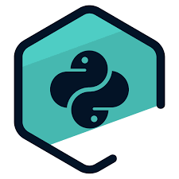
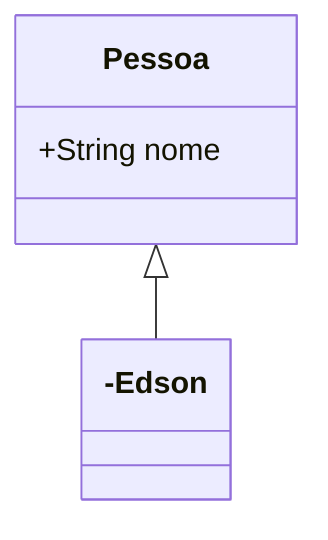

# Titulo da página

## Edson Docs (subtitulo)

### Listas nao ordenadas
- X
- Y
- Z

### Listas ordenadas

1. Primeiro
2. Segundo
3. Terceiro


## Alteracoes de texto

**Negrito**

*italico*

`segredo = 42`

## Citações

> Essa é uma citação

## Link
[DuckDuckGo](http://ddg.gg)




## Bloco de código

```{.py3 hl_lines="1 3" linenums="1" title="my_file_python.py"}
def soma(x, y):
"""docstring."""
    return x + y
```

## Tabela

| Nome | Idade |
| ---- | ----- |
| Jane | 52 |
| Jully | 24 |

## Lista de tarefas

- [ ] Analise de dados
- [ ] Estudo Python
- [x] Estudo PySpark

Emoji - :snake: :heart: :rocket:

~~Tachado~~

==Realçado==


## Custom fences



For full documentation visit [mkdocs.org](https://www.mkdocs.org).

## Commands

* `mkdocs new [dir-name]` - Create a new project.
* `mkdocs serve` - Start the live-reloading docs server.
* `mkdocs build` - Build the documentation site.
* `mkdocs -h` - Print help message and exit.

## Project layout

    mkdocs.yml    # The configuration file.
    docs/
        index.md  # The documentation homepage.
        ...       # Other markdown pages, images and other files.
