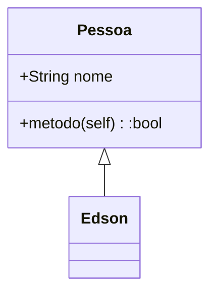
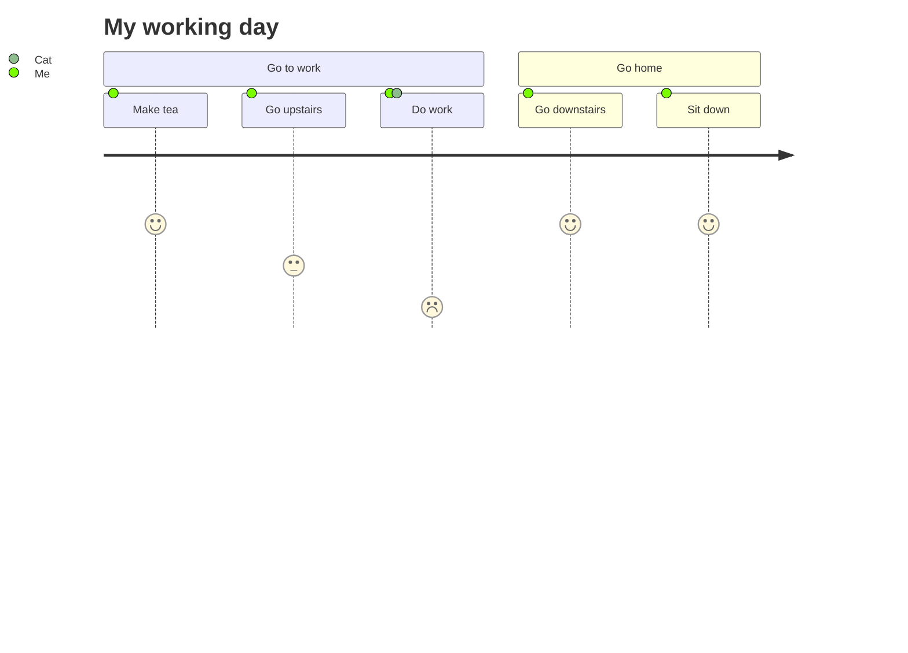

# pagina 2

## Bloco de código

```{.py3}
def xpto():
    """docstring."""
    return 'Hello!!'
```

## Custom fences

```mermaid
classDiagram
    Pessoa <|-- Edson
    class Pessoa{
        +String nome
        +metodo(self):bool

    }
```

## Custom fences

```mermaid
journey
    title My working day
    section Go to work
      Make tea: 5: Me
      Go upstairs: 3: Me
      Do work: 1: Me, Cat
    section Go home
      Go downstairs: 5: Me
      Sit down: 5: Me
```